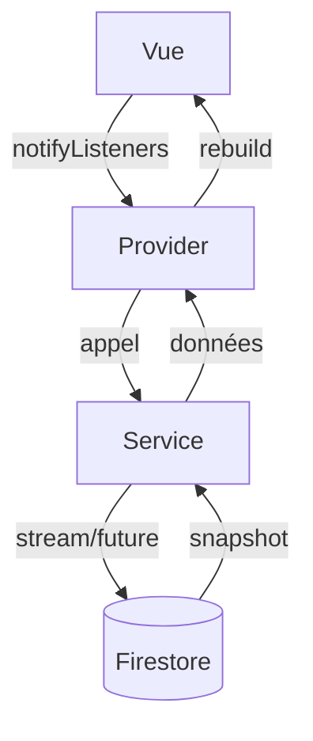
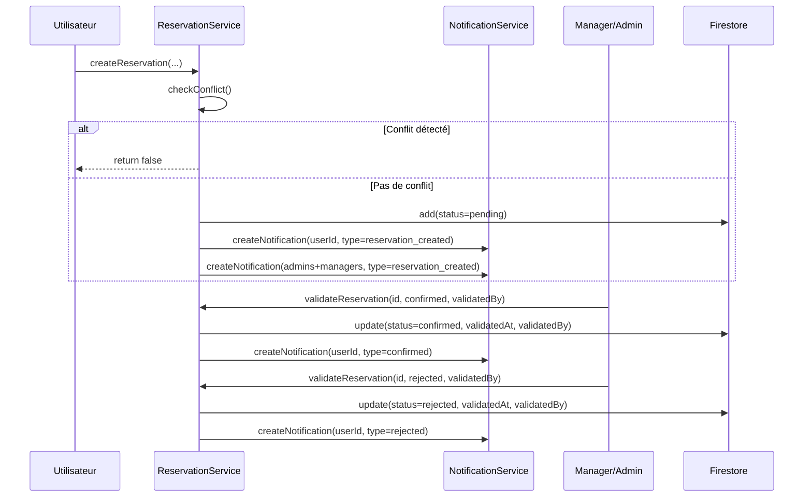

# Document de Design Technique — FlutterBooking

## Vue d'ensemble

FlutterBooking est une application mobile Flutter de réservation de ressources partagées (salles, véhicules, ordinateurs, matériel). Elle s'appuie sur Firebase (Auth + Firestore) pour l'authentification et la persistance, `table_calendar` pour la visualisation des disponibilités, et le pattern Provider pour la gestion d'état.

Ce document décrit l'architecture technique, les modèles de données, les services, les providers, la navigation, et les propriétés de correction à valider par des tests automatisés.

**Périmètre de cette itération :**
- Complétion des providers existants (squelettes actuellement vides)
- Ajout du `NotificationModel` et du badge de notifications
- Implémentation du `PdfService` et de l'`ICalService`
- Renforcement du `ReservationService` (champs `resourceName`, `validatedBy`)
- Dashboard admin avec statistiques en temps réel
- Ajout des dépendances `share_plus` et `flutter_local_notifications`

---

## Architecture

L'application suit une **Clean Architecture adaptée Flutter** avec trois couches :

```
┌─────────────────────────────────────────────────────┐
│                    VUES (Views)                      │
│  lib/views/  ·  lib/widgets/                        │
│  Affichage uniquement, consomment les Providers      │
└──────────────────────┬──────────────────────────────┘
                       │ Consumer / Provider.of
┌──────────────────────▼──────────────────────────────┐
│                  PROVIDERS (State)                   │
│  lib/providers/                                      │
│  ChangeNotifier, orchestrent Services + état UI      │
└──────────────────────┬──────────────────────────────┘
                       │ appels directs
┌──────────────────────▼──────────────────────────────┐
│                  SERVICES (Logique métier)            │
│  lib/services/                                       │
│  Accès Firestore, Firebase Auth, génération fichiers │
└──────────────────────┬──────────────────────────────┘
                       │
┌──────────────────────▼──────────────────────────────┐
│              MODÈLES (Data Models)                   │
│  lib/models/                                         │
│  Entités pures, sérialisation Firestore              │
└─────────────────────────────────────────────────────┘
```

**Règle fondamentale :** les vues n'appellent jamais Firestore directement. Toute logique métier passe par les services.

### Diagramme de flux de données



---

## Composants et Interfaces

### Structure des fichiers (existant + ajouts)

```
lib/
├── models/
│   ├── user_model.dart          ✅ existant (à enrichir)
│   ├── resource_model.dart      ✅ existant (complet)
│   ├── reservation_model.dart   ✅ existant (complet)
│   └── notification_model.dart  🆕 à créer
├── services/
│   ├── auth_service.dart        ✅ existant (complet)
│   ├── reservation_service.dart ✅ existant (à enrichir)
│   ├── notification_service.dart✅ existant (à enrichir)
│   ├── preferences_service.dart ✅ existant
│   ├── pdf_service.dart         🆕 à créer
│   └── ical_service.dart        🆕 à créer
├── providers/
│   ├── auth_provider.dart       ⚠️ squelette (à compléter)
│   ├── resource_provider.dart   ⚠️ squelette (à compléter)
│   └── calendar_provider.dart   ⚠️ squelette (à compléter)
├── views/
│   ├── auth/                    ✅ existant
│   ├── home/                    ✅ existant
│   ├── resources/               ✅ existant
│   ├── calendar/                ✅ existant
│   ├── notifications/           ✅ existant (à enrichir)
│   ├── profile/                 ✅ existant
│   └── admin/                   ✅ existant (à enrichir)
└── widgets/
    ├── calendar_widget.dart     ✅ existant
    ├── reservation_modal.dart   ✅ existant
    ├── resource_card.dart       ✅ existant
    └── notification_badge.dart  🆕 à créer
```

### Dépendances à ajouter dans `pubspec.yaml`

```yaml
share_plus: ^10.0.0          # partage PDF et fichier .ics
flutter_local_notifications: ^17.0.0  # badge sur l'icône (optionnel, fallback: compteur en mémoire)
```

---

## Modèles de données

### UserModel

**Collection Firestore :** `users/{userId}`

```dart
class UserModel {
  final String id;
  final String name;
  final String email;
  final String role;          // 'user' | 'manager' | 'admin'
  final DateTime createdAt;
  final DateTime updatedAt;
}
```

**Schéma Firestore :**
```json
{
  "name": "string",
  "email": "string",
  "role": "user | manager | admin",
  "createdAt": "Timestamp",
  "updatedAt": "Timestamp"
}
```

**Méthodes à ajouter :**
- `factory UserModel.fromFirestore(Map<String, dynamic> data, String id)`
- `Map<String, dynamic> toFirestore()`
- `bool get isAdmin => role == 'admin'`
- `bool get isManager => role == 'manager' || role == 'admin'`

---

### ResourceModel

**Collection Firestore :** `resources/{resourceId}`

Modèle existant — complet. Ajouter `toFirestore()` pour le CRUD admin :

```dart
Map<String, dynamic> toFirestore() => {
  'name': name,
  'description': description,
  'image': image,
  'capacity': capacity,
  'category': category,
};
```

---

### ReservationModel

**Collection Firestore :** `reservations/{reservationId}`

Modèle existant — complet. Champs présents :
- `id`, `resourceId`, `resourceName`, `userId`, `userName`
- `startTime`, `endTime` (DateTime)
- `status` : `pending | confirmed | cancelled | rejected`
- `notes`, `createdAt`, `validatedAt`, `validatedBy`

**Enrichissement :** s'assurer que `createReservation` dans le service enregistre bien `resourceName` (dénormalisé).

---

### NotificationModel

**Collection Firestore :** `notifications/{notificationId}`

```dart
class NotificationModel {
  final String id;
  final String userId;
  final String title;
  final String message;
  final String type;          // 'reservation_created' | 'confirmed' | 'rejected' | 'cancelled'
  final String reservationId;
  final bool isRead;
  final DateTime createdAt;

  factory NotificationModel.fromFirestore(Map<String, dynamic> data, String id);
  Map<String, dynamic> toFirestore();
}
```

**Schéma Firestore :**
```json
{
  "userId": "string",
  "title": "string",
  "message": "string",
  "type": "reservation_created | confirmed | rejected | cancelled",
  "reservationId": "string",
  "isRead": false,
  "createdAt": "Timestamp"
}
```

---

## Services

### AuthService (existant — complet)

Interface publique :
```dart
Stream<User?> get user
User? get currentUser
Future<UserCredential> signIn(String email, String password)
Future<UserCredential> signUp(String email, String password)
Future<void> saveUserData({userId, name, email, role})
Future<Map<String, dynamic>?> getUserData(String userId)
Future<void> updateUserProfile({String? name, String? email})
Future<void> signOut()
Future<String?> getUserRole()
```

---

### ReservationService (existant — à enrichir)

Enrichissements requis :
1. `createReservation` doit accepter `resourceName` et l'enregistrer dans Firestore
2. `validateReservation` doit enregistrer `validatedBy` (nom du validateur)
3. `checkConflict` doit accepter un paramètre optionnel `excludeReservationId` pour la modification

```dart
Future<bool> createReservation({
  required String resourceId,
  required String resourceName,   // 🆕
  required String userId,
  required String userName,
  required DateTime startTime,
  required DateTime endTime,
  String? notes,
})

Future<bool> checkConflict(
  String resourceId,
  DateTime startTime,
  DateTime endTime, {
  String? excludeReservationId,   // 🆕 pour la modification
})

Future<void> validateReservation(
  String reservationId,
  String status,
  String validatedBy,             // 🆕
)
```

**Logique de détection de conflit (invariant central) :**
```
conflit = startTime_nouvelle < endTime_existante
       AND endTime_nouvelle > startTime_existante
       AND status_existante ∈ {pending, confirmed}
```

---

### NotificationService (existant — à enrichir)

Enrichissements requis :
1. Retourner `List<NotificationModel>` au lieu de `List<QueryDocumentSnapshot>`
2. Ajouter `markAllAsRead(String userId)`

```dart
Stream<List<NotificationModel>> getUserNotifications(String userId)
Stream<int> getUnreadCount(String userId)
Future<void> markAsRead(String notificationId)
Future<void> markAllAsRead(String userId)
Future<void> createNotification({
  required String userId,
  required String title,
  required String message,
  required String type,
  required String reservationId,
})
```

**Événements déclenchant des notifications :**

| Événement | Destinataires | Type |
|-----------|--------------|------|
| Réservation créée | Utilisateur | `reservation_created` |
| Réservation créée | Tous admins + managers | `reservation_created` |
| Réservation confirmée | Utilisateur concerné | `confirmed` |
| Réservation rejetée | Utilisateur concerné | `rejected` |
| Réservation annulée | Tous admins + managers | `cancelled` |

---

### PdfService (nouveau)

```dart
class PdfService {
  /// Génère un PDF de confirmation et retourne les bytes
  Future<Uint8List> generateConfirmationPdf(
    ReservationModel reservation,
    ResourceModel resource,
  )

  /// Partage le PDF via le système natif (share_plus)
  Future<void> sharePdf(Uint8List pdfBytes, String fileName)
}
```

**Contenu du PDF :**
- En-tête : logo/titre "FlutterBooking — Confirmation de réservation"
- Nom de la ressource
- Date et heure de début / fin
- Nom de l'utilisateur
- Statut : `Confirmée`
- Date de validation
- Notes (si présentes)
- Identifiant de réservation (pied de page)

---

### ICalService (nouveau)

```dart
class ICalService {
  /// Génère le contenu d'un fichier .ics (String)
  String generateIcs(ReservationModel reservation)

  /// Parse un fichier .ics et retourne les champs extraits
  Map<String, String> parseIcs(String icsContent)

  /// Partage le fichier .ics via le système natif
  Future<void> shareIcs(ReservationModel reservation)
}
```

**Format .ics (RFC 5545) :**
```
BEGIN:VCALENDAR
VERSION:2.0
PRODID:-//FlutterBooking//FR
BEGIN:VEVENT
UID:{reservation.id}@flutterbooking
DTSTART:{startTime en format YYYYMMDDTHHmmssZ}
DTEND:{endTime en format YYYYMMDDTHHmmssZ}
SUMMARY:{resourceName}
DESCRIPTION:{notes}
END:VEVENT
END:VCALENDAR
```

---

## Providers

### UserAuthProvider (squelette → à compléter)

```dart
class UserAuthProvider extends ChangeNotifier {
  UserModel? _currentUser;
  bool _isLoading = false;
  String? _error;

  UserModel? get currentUser => _currentUser;
  bool get isLoading => _isLoading;
  bool get isAdmin => _currentUser?.role == 'admin';
  bool get isManager => _currentUser?.role == 'manager' || isAdmin;
  String? get error => _error;

  Future<void> loadCurrentUser(String userId)
  Future<void> updateProfile(String name)
  void clear()
}
```

---

### ResourceProvider (squelette → à compléter)

```dart
class ResourceProvider extends ChangeNotifier {
  List<ResourceModel> _resources = [];
  String? _categoryFilter;
  bool _isLoading = false;
  StreamSubscription? _subscription;

  List<ResourceModel> get resources => _filteredResources();
  List<ResourceModel> get allResources => _resources;
  String? get categoryFilter => _categoryFilter;
  bool get isLoading => _isLoading;

  void initialize()                          // démarre le stream Firestore
  void setCategoryFilter(String? category)   // filtre par catégorie
  List<ResourceModel> _filteredResources()   // logique de filtrage pure
  Future<void> createResource(ResourceModel r)
  Future<void> updateResource(ResourceModel r)
  Future<void> deleteResource(String id)
  void dispose()
}
```

---

### CalendarProvider (squelette → à compléter)

```dart
class CalendarProvider extends ChangeNotifier {
  DateTime _selectedDay = DateTime.now();
  String? _currentResourceId;
  List<ReservationModel> _resourceReservations = [];
  StreamSubscription? _subscription;

  DateTime get selectedDay => _selectedDay;
  List<ReservationModel> get activeReservations =>
      _resourceReservations.where((r) => r.isActive).toList();

  void selectDay(DateTime day)
  void loadResourceReservations(String resourceId)
  List<int> getOccupiedHours(DateTime day)   // retourne les heures occupées pour un jour
  bool isSlotAvailable(DateTime start, DateTime end)
  void dispose()
}
```

---

## Navigation et Routing

La navigation est gérée par `onGenerateRoute` dans `main.dart` (existant). Routes à maintenir et compléter :

```
/                   → AuthWrapper (redirection auto)
/login              → LoginPage
/signup             → SignupPage
/home               → MainShell (bottom navigation)
  ├── tab 0         → ResourcesPage (catalogue)
  ├── tab 1         → CalendarPage (vue calendrier globale)
  ├── tab 2         → MyReservationsPage (mes réservations)
  ├── tab 3         → NotificationsPage (avec badge)
  └── tab 4         → ProfilePage
/resources          → ResourcesPage
/resource_detail    → ResourceDetailPage (args: ResourceModel)
/booking            → BookingPage (args: ResourceModel)
/edit_reservation   → EditReservationPage (args: ReservationModel)
/admin              → AdminPage (accès conditionnel rôle admin/manager)
```

**Contrôle d'accès :** `MainShell` vérifie le rôle via `UserAuthProvider` pour afficher ou masquer les onglets admin.

---

## Vues et Widgets

### NotificationBadge (nouveau widget)

Widget réutilisable affichant un badge numérique sur l'icône de notifications :

```dart
class NotificationBadge extends StatelessWidget {
  final Widget child;
  final int count;   // 0 = badge masqué

  // Affiche un cercle rouge avec le nombre si count > 0
  // Masque le badge si count == 0
}
```

### AdminDashboardPage (enrichissement)

Affiche en temps réel via streams Firestore :
- Compteurs par statut (pending, confirmed, cancelled, rejected)
- Top 5 ressources les plus réservées
- Réservations de la semaine courante et du mois courant

### NotificationsPage (enrichissement)

- Liste `NotificationModel` triée par date décroissante
- Distinction visuelle lu/non lu (fond coloré ou opacité)
- Tap sur une notification → `markAsRead` + navigation vers la réservation concernée

---

## Logique de détection de conflits

La détection de conflit est la règle métier centrale. Elle est implémentée dans `ReservationService.checkConflict()` et doit être **pure** (testable sans Firestore) :

```dart
/// Vérifie si [newStart, newEnd[ chevauche [existingStart, existingEnd[
static bool overlaps(
  DateTime newStart, DateTime newEnd,
  DateTime existingStart, DateTime existingEnd,
) {
  return newStart.isBefore(existingEnd) && newEnd.isAfter(existingStart);
}
```

**Cas limites :**
- Créneaux adjacents (fin A == début B) → **pas de conflit** (condition stricte)
- Créneau identique → conflit
- Créneau inclus dans un autre → conflit
- Réservations `cancelled` ou `rejected` → **ignorées** dans la vérification

**Lors d'une modification**, la réservation en cours d'édition est exclue de la vérification via `excludeReservationId`.

---

## Workflow de validation Manager



---

## Système de notifications in-app

Les notifications sont **100% Firestore** (pas de push externe). Le flux est :

1. Un événement métier (création, validation, annulation) appelle `NotificationService.createNotification()`
2. Le document est écrit dans `notifications/{id}`
3. `NotificationsPage` écoute `getUserNotifications(userId)` via un stream
4. `getUnreadCount(userId)` alimente le badge dans `MainShell`
5. Le tap sur une notification appelle `markAsRead(notificationId)`

**Badge :** `NotificationBadge` est intégré dans le `BottomNavigationBar` de `MainShell`. Il se met à jour automatiquement via `StreamBuilder<int>` sur `getUnreadCount`.

---

## Fonctionnalités bonus

### PDF de confirmation

Flux : `MyReservationsPage` → bouton "PDF" sur réservation confirmée → `PdfService.generateConfirmationPdf()` → `PdfService.sharePdf()` → système de partage natif (`share_plus`).

### Export iCal

Flux : `MyReservationsPage` → bouton "iCal" sur réservation confirmée → `ICalService.generateIcs()` → `ICalService.shareIcs()` → système de partage natif.

### Dashboard Admin

`AdminDashboardPage` utilise trois `StreamBuilder` indépendants sur Firestore pour afficher les statistiques en temps réel. Aucune agrégation côté serveur — tout est calculé côté client sur les snapshots.

---

## Propriétés de correction

*Une propriété est une caractéristique ou un comportement qui doit être vrai pour toutes les exécutions valides d'un système — essentiellement, un énoncé formel de ce que le système doit faire. Les propriétés servent de pont entre les spécifications lisibles par l'humain et les garanties de correction vérifiables par machine.*

**Réflexion sur la redondance :**
- Les critères 6.1 et 6.6 portent tous deux sur la détection de conflit → fusionnés en une seule propriété complète.
- Les critères 6.2 et 8.4 sont des edge cases couverts par la propriété de conflit.
- Les critères 12.1 et 12.3 sont distincts : l'un vérifie la présence des champs RFC 5545, l'autre le round-trip.
- Le critère 9.4 (badge) est une propriété pure sur le comptage.
- Le critère 5.5 (validation créneau) est une propriété pure sur la comparaison de dates.
- Le critère 3.2 (filtrage ressources) est une propriété pure sur le filtrage.
- Le critère 11.1 (contenu PDF) est une propriété sur la génération.

**Bibliothèque PBT retenue :** [`dart_test`](https://pub.dev/packages/test) avec [`fast_check`](https://pub.dev/packages/fast_check) (ou `glados` pour Dart). Chaque test est configuré pour un minimum de 100 itérations.

---

### Propriété 1 : Correction de la détection de chevauchement

*Pour tout* créneau candidat `[newStart, newEnd[` et toute réservation active existante `[existingStart, existingEnd[`, la fonction `overlaps` retourne `true` si et seulement si `newStart < existingEnd AND newEnd > existingStart`, et `false` dans tous les autres cas (créneaux adjacents, disjoints, ou réservation annulée/rejetée).

**Validates: Requirements 6.1, 6.6**

---

### Propriété 2 : Symétrie de la détection de conflit

*Pour tout* couple de créneaux `[s1, e1[` et `[s2, e2[`, `overlaps(s1, e1, s2, e2) == overlaps(s2, e2, s1, e1)` — la relation de chevauchement est symétrique.

**Validates: Requirements 6.6**

---

### Propriété 3 : Round-trip iCal

*Pour toute* réservation confirmée avec des données valides (id, resourceName, startTime, endTime, notes), générer le fichier `.ics` puis le parser puis re-générer doit produire un contenu `.ics` équivalent : `generate(parse(generate(r))) == generate(r)`.

**Validates: Requirements 12.3**

---

### Propriété 4 : Champs RFC 5545 présents dans le fichier iCal

*Pour toute* réservation confirmée, le fichier `.ics` généré par `ICalService.generateIcs()` doit contenir les champs `UID`, `DTSTART`, `DTEND`, `SUMMARY` et `DESCRIPTION`.

**Validates: Requirements 12.1**

---

### Propriété 5 : Exactitude du badge de notifications

*Pour toute* liste de notifications avec des états `isRead` variés, le compteur retourné par `getUnreadCount` doit être exactement égal au nombre d'éléments de la liste dont `isRead == false`.

**Validates: Requirements 9.4, 9.5**

---

### Propriété 6 : Validation de créneau (endTime > startTime)

*Pour tout* couple `(startTime, endTime)`, la validation de créneau doit accepter uniquement les paires où `endTime` est strictement postérieur à `startTime`, et rejeter toutes les autres (égaux ou inversés).

**Validates: Requirements 5.5**

---

### Propriété 7 : Correction du filtrage par catégorie

*Pour toute* liste de ressources et tout filtre de catégorie non nul, le résultat de `_filteredResources()` ne doit contenir que des ressources dont le champ `category` est égal au filtre appliqué.

**Validates: Requirements 3.2**

---

### Propriété 8 : Contenu du PDF de confirmation

*Pour toute* réservation confirmée avec des données valides, le PDF généré par `PdfService.generateConfirmationPdf()` doit contenir le nom de la ressource, les dates de début et de fin, le nom de l'utilisateur et le statut `confirmed`.

**Validates: Requirements 11.1**

---

## Gestion des erreurs

| Situation | Comportement attendu |
|-----------|---------------------|
| Conflit de réservation | `createReservation` retourne `false`, la vue affiche un `SnackBar` d'erreur |
| Identifiants Firebase invalides | `AuthService.signIn` lève une exception, la vue affiche un message sans détail technique |
| Nom vide (profil/ressource) | Validation côté vue avant appel service, message d'erreur inline |
| Capacité < 1 (ressource) | Validation côté vue, blocage de la soumission |
| Échec génération PDF | `PdfService` lève une exception, la vue affiche un `SnackBar` d'erreur |
| Firestore indisponible | Les streams retournent une erreur, les vues affichent un état d'erreur avec icône |
| Réservation déjà annulée/rejetée | Les boutons d'action sont masqués (condition sur `status`) |

---

## Stratégie de tests

### Tests unitaires (example-based)

- `AuthService` : mock Firebase Auth, vérifier création compte et chargement profil
- `ReservationService.checkConflict` : cas concrets (chevauchement partiel, adjacent, inclus)
- `NotificationService.createNotification` : mock Firestore, vérifier les champs du document
- `ICalService.generateIcs` : vérifier le format de sortie sur un exemple fixe
- `PdfService.generateConfirmationPdf` : vérifier que les bytes générés sont non vides

### Tests de propriétés (property-based)

Utiliser `fast_check` ou `glados`. Chaque test est configuré pour **100 itérations minimum**.

```dart
// Exemple de tag de propriété
// Feature: flutter-booking-app, Property 1: Correction de la détection de chevauchement
test('overlaps est correct pour tout créneau', () {
  // générateur de DateTime aléatoires
  // vérification de la condition de chevauchement
});
```

Propriétés à implémenter :
- **Property 1** : correction de `overlaps` (100+ itérations)
- **Property 2** : symétrie de `overlaps` (100+ itérations)
- **Property 3** : round-trip iCal (100+ itérations)
- **Property 4** : champs RFC 5545 présents (100+ itérations)
- **Property 5** : exactitude du badge (100+ itérations)
- **Property 6** : validation créneau (100+ itérations)
- **Property 7** : filtrage par catégorie (100+ itérations)
- **Property 8** : contenu PDF (100+ itérations)

### Tests d'intégration

- Création de réservation bout-en-bout avec Firestore émulé
- Workflow de validation (pending → confirmed/rejected)
- Lecture/écriture des notifications
- Authentification avec Firebase Auth émulé
